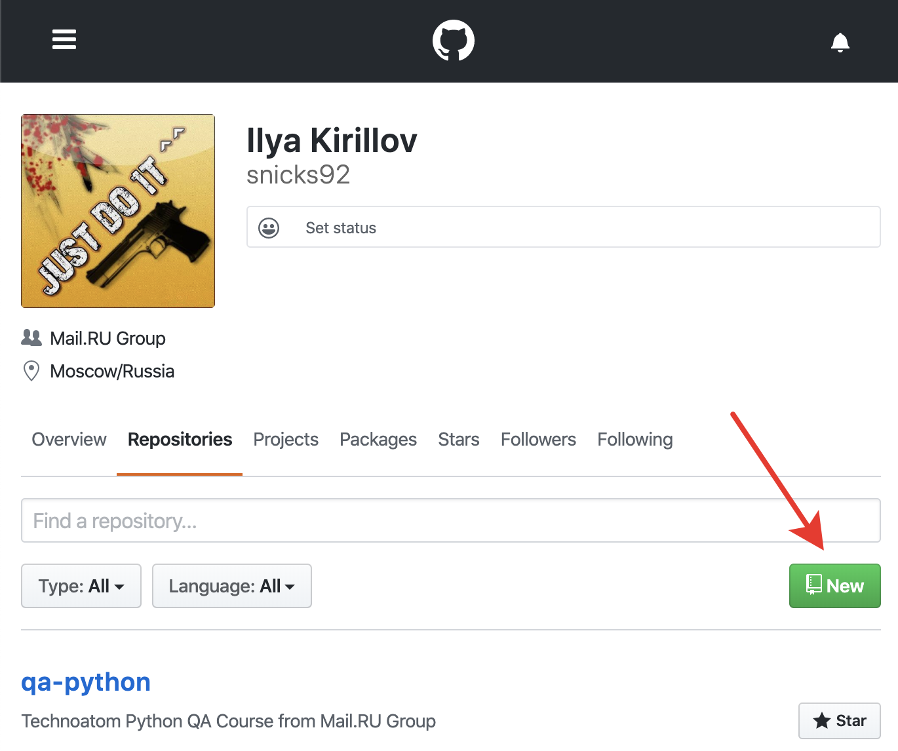
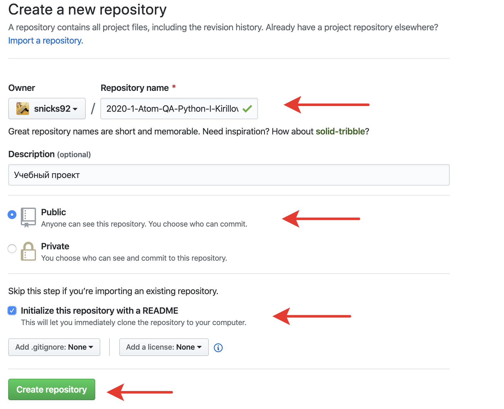
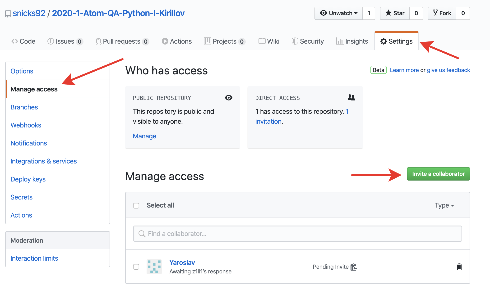
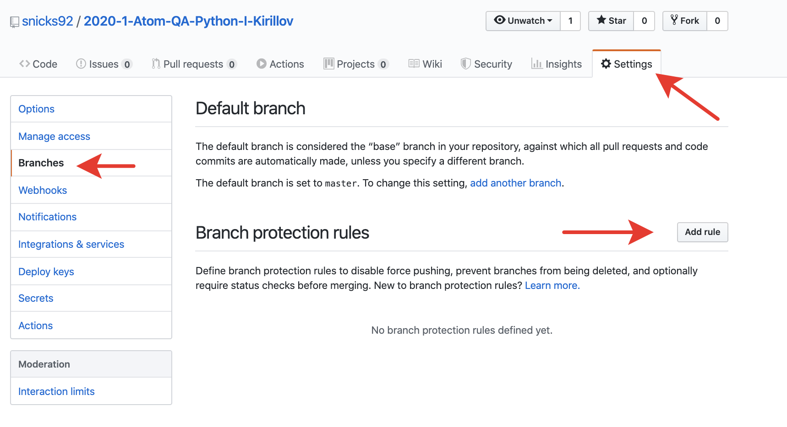
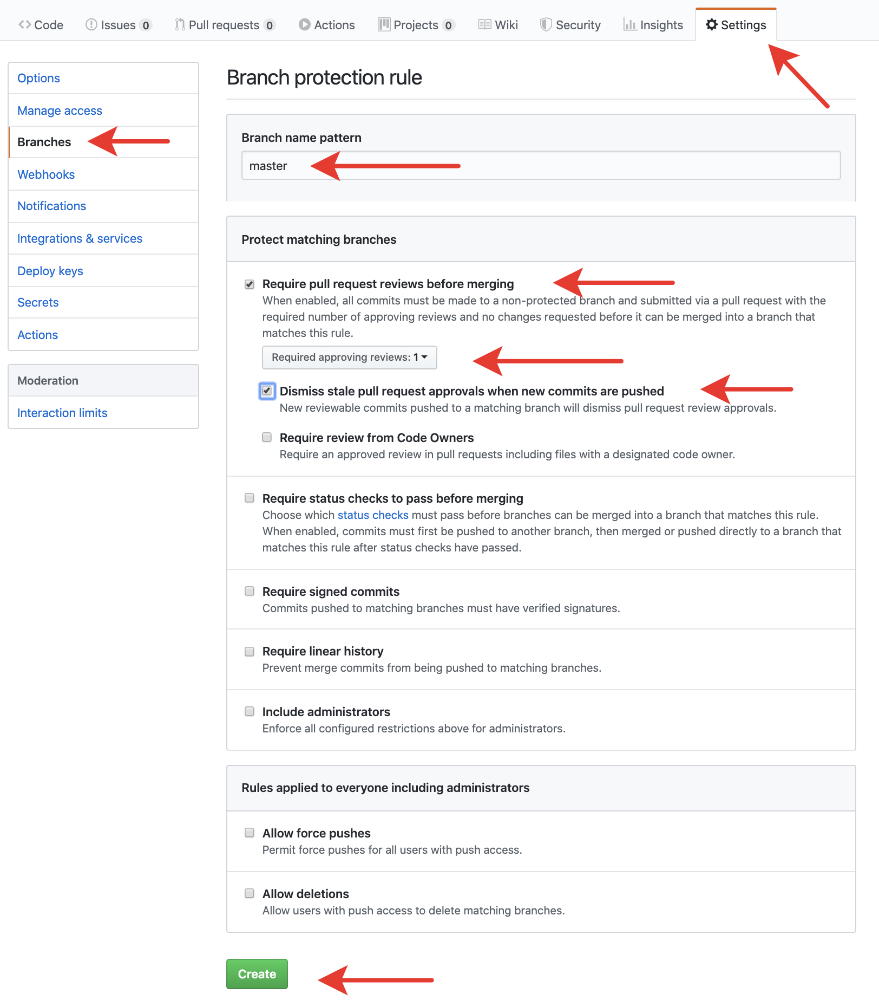
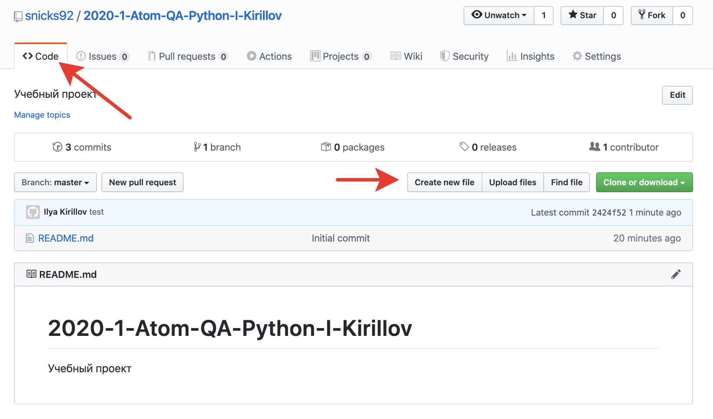
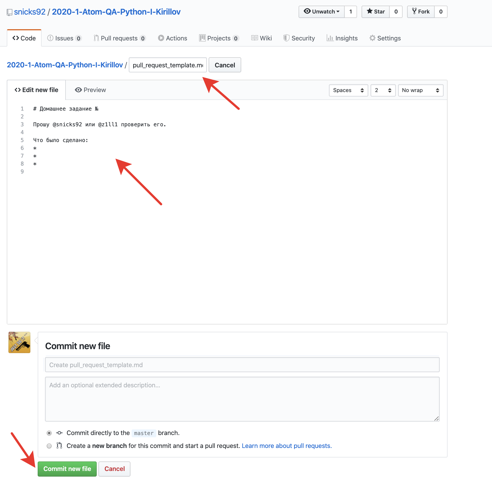
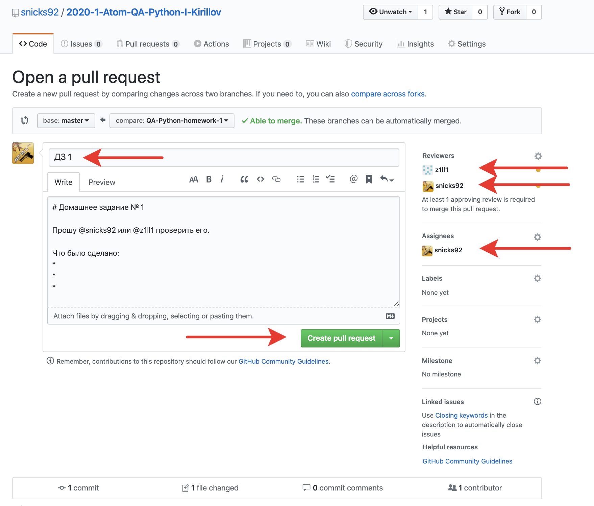

# homework

### Инструкция по рабочему процессу с ДЗ

### 1. Создаем репозиторий
* Заходим на [GitHub](https://github.com/)
* Создаем новый репозиторий



### 2. Присваиваем имя репозиторию по шаблону
* Создаем имя репозитория по следующему шаблону:

`YYYY-HALF_YEAR-PROJECT_NAME-QA-Python-N-LAST_NAME`, где:

`YYYY` - год

`HALF_YEAR` - половина года. `1`, если сейчас `янв-июн`, `2`, если `июл-дек`

`PROJECT_NAME` - название обучающего проекта. `Track` для `Технотрека`, `Atom` для `Техноатома`

`N` - первая буква имени

`LAST_NAME` - фамилия

Например, `2020-1-Atom-QA-Python-I-Kirillov`.

Пожалуйста, проверьте дважды правильность имени вашего репозитория, это облегчит работу по проверке и оценке ваших работ.



### 3. Добавляем преподавателей в коллабораторы
 * Заходим в настройки репозитория (/settings/access)
 * Добавляем `snicks92`, `z1ll1` и `SK1995` в collaborators

 Нам придут приглашения, перед сдачей ДЗ нужно будет дождаться, пока мы их примем.



### 4. Создаем правило для ветки
* Заходим в настройки веток (branches)
* Создаем новое правило



### 5. Настраиваем правило
* Защищаем ветку `master` от пуша
* Требуем мерж по пулл-реквесту с обязательным апрувом от одного ревьюера



### 6. Создаем шаблон для PR
* Создаем файл с именем `pull_request_template.md` в корне проекта
* Содержимое должно быть следующим:
```md
# Домашнее задание №

Прошу @snicks92 или @z1ll1 или @SK1995 проверить его.

Что было сделано:
*
*
*

```

Это шаблон для ваших `PR`, в котором есть упоминания всех преподавателей (для получения уведомлений). Сам файл при сдаче ДЗ редактировать не нужно. Вместо этого, при создании `PR` нужно в `GitHub` коротко описать проделанную работу.





### 7. Сдаем ДЗ на проверку
* Создаем новую ветку в формате
`QA-Python-homework-N`, где:
`N` - номер домашнего задания
* После выполнения домашнего задания, создаем пулл-реквест в ветку `master`
* Добавляем `snicks92`, `z1ll1` и `SK1995` в поле `reviewers`
* Добавляем того, кто выдал домашнее задание (лектора конкретной лекции) в поле `assignee`
* В теме **обязательно** пишем номер ДЗ, в описании опционально пишем то, что сделано



### 8. Ожидаем проверки и вносим правки
 * Жмем на большую зеленую кнопку и ждем комментариев
 * Если все выполнено корректно - выполняется мерж
 * Если есть недочеты - будут оставлены замечания, которые надо будет быстро исправить и запушить в текущий PR. Мы их увидим и пересоздавать PR не нужно
 * С момента создания пулл-реквеста в него запрещается вносить изменения, пока его не проверит преподаватель.
 Внесение изменений после создания пулл-реквеста и до момента комментирования преподавателем приравнивается к сдаче домашнего задания не в срок.

___

### 9. Правила сдачи ДЗ
* Для всех ДЗ один репозиторий
* В одном PR сдается только **одно** ДЗ
* Каждое ДЗ делается в отдельной ветке, чтобы избежать возможных конфликтов при мерже
* Каждая ветка, из которой делается PR, должна быть синхронизирована с `master`

### 10. Критерии оценки ДЗ
* Для того, чтобы успешно сдать домашнее задание без применения штрафов (снятие 30% баллов) - нужно вовремя создать PR
* Срок сдачи каждого задания - 1 неделя с момента его выдачи на лекции (кроме первого, срок сдачи первого ДЗ - 2 недели)
* Если вы не уложились в срок сдачи домашнего задания, то применяется штраф 30% от максимального балла за данное домашнее задание
* Максимальной оценкой оценивается решение, которое было выполнено правильно с первого раза согласно критериям проверки
* Если были допущены сильные недочеты, то баллы снижаются в зависимости от степени замечаний на усмотрение преподавателя